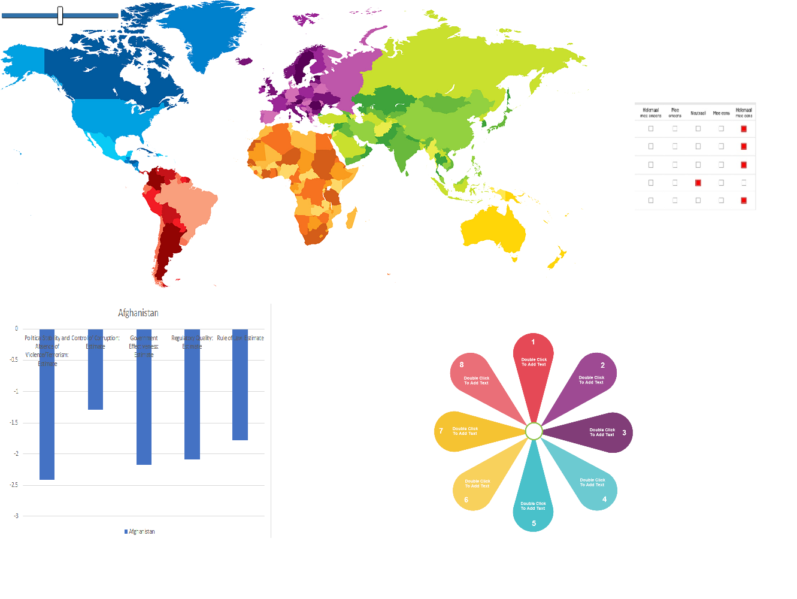

# ProgrammeerProject - Corporate tax
-  **Daan Uittenhout**
-  *11057777*
-  Minor Programmeren
https://daanuittenhout.github.io/DataProcessing

## Goals
- Help companies choose the country where they want to have their hq's and show why some countries are popular
## Problem Statement
The Problem is in this case that companies do not have a decent overview of the countries where they should locate their HQ's and this will provide that

## Visualisations
### Visualisation of the World map
The world map will show on click/hoover the corporate tax rate of that specific country. The colours of the countries will indicate in which range their tax rate is in that specific year.
### Visualisation of a Barchart
The barchart will show the score of the different pillars
- The Pillars
  * minimum wage
  * education level
  * costs of (raw)materials
  * human rights
  * environment index
  * child labour index
  * religion
  * innovation level
  * level of infrastructure
  * English speaking percentage
  * political stability

### Visualisation of a flower chart
there will be a checkbox how important the visitor evaluates the different pillars and than the top 5 matches will appear on the svg as a flower chart
- The Pillars
  * minimum wage
  * education level
  * costs of (raw)materials
  * human rights
  * environment index
  * child labour index
  * religion
  * innovation level
  * level of infrastructure
  * English speaking percentage
  * political stability

### Interactive components
* the checkboxes to compare all the stats of countries
* slider for the different years

## Data Sources
- https://stats.oecd.org/index.aspx?DataSetCode=Table_II1
- http://databank.worldbank.org/data/reports.aspx?source=worldwide-governance-indicators
## Code Sources

## Libraries
* Bootstrap.min.js - Copyright 2011-2014 Twitter, Inc.
* Bootstrap.min.css - Copyright 2011-2014 Twitter, Inc.
* d3.min.js - Copyright 2015 Mike Bostock
* datamaps.world.min.js - MIT License Mark DiMarco
* topojson.min.js - Copyright (c) 2012-2016, Michael Bostock All rights reserved
