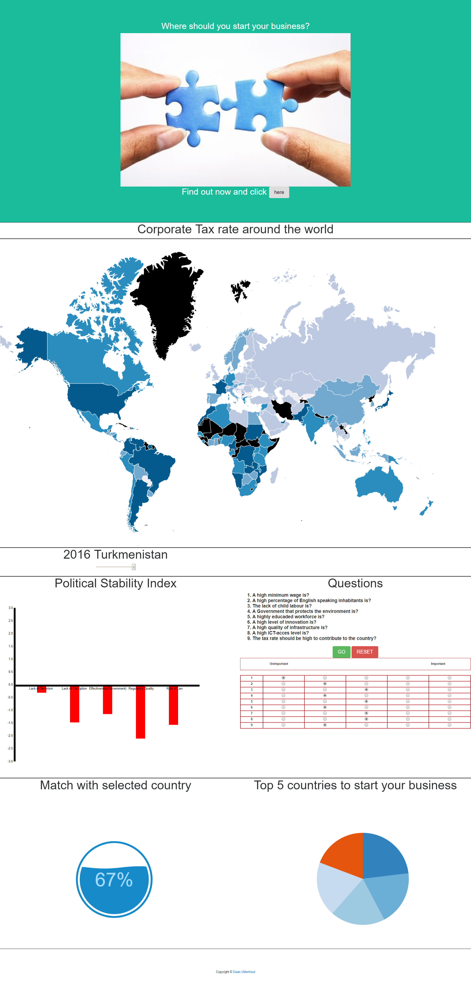

# Final report
* Daan Uittenhout
* 11057777
* Minor Programmeren

## Description
The site is a visualization of different data sets, designed to help businesses to choose a new country to expand to.

The user can choose a country, when clicking on the map. Than the user can check its political stability over the years with the use of a slider. After checking these two data sets, the user could fill out the questions and checking the right radio buttons. If and only if all the questions are filled out you will get an overview of the top 5 matched countries in a pie chart. When the pie chart is clicked the percentage of the match with respect to the questions will be showed in a bubble gauge.  

The functionality mainly consists of an interactive map, an interactive bar chart with slider, checkboxes that generate a pie chart and a gauge that will pop when the pie chart is clicked.

## Design

the code consists of the following scripts:

- main.js for the functionality
- helpers.js for the functions used in the main
- match.js for the bubble gauge  

The functions in the helpers script are use to update the charts, calculate matches and some functions to shorten the main.
